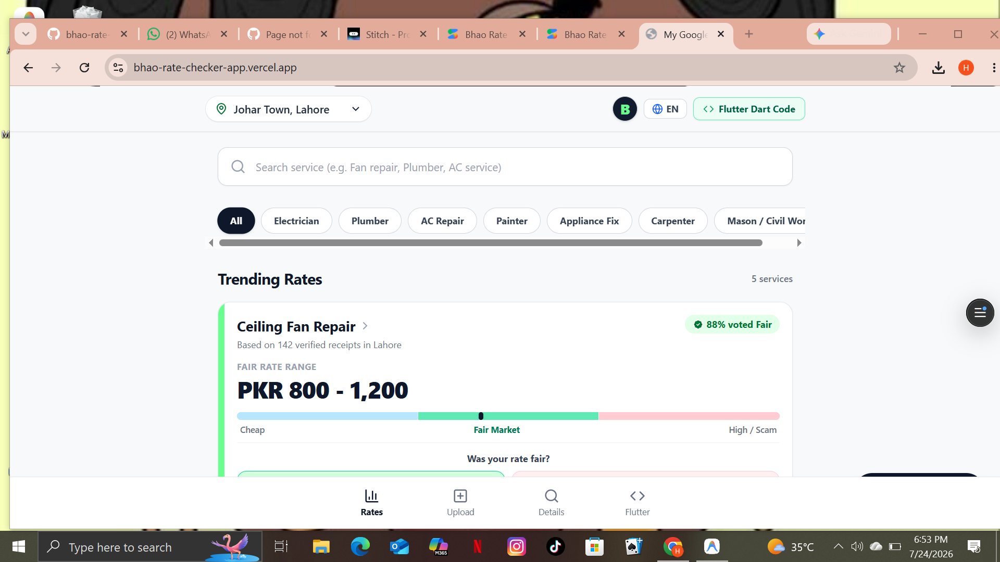
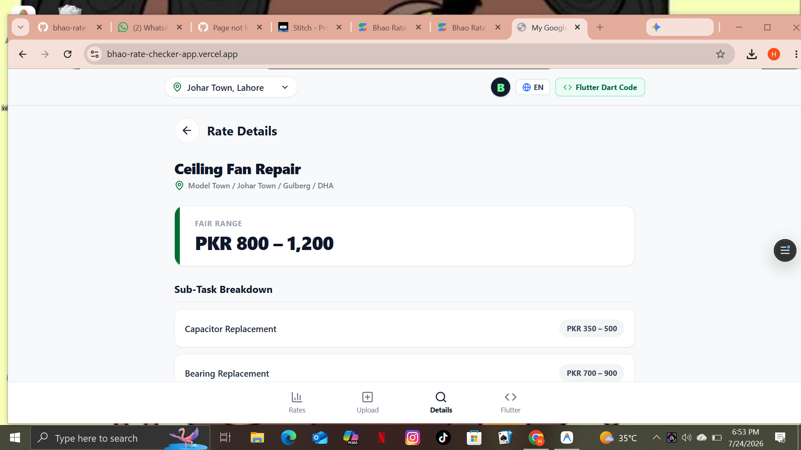
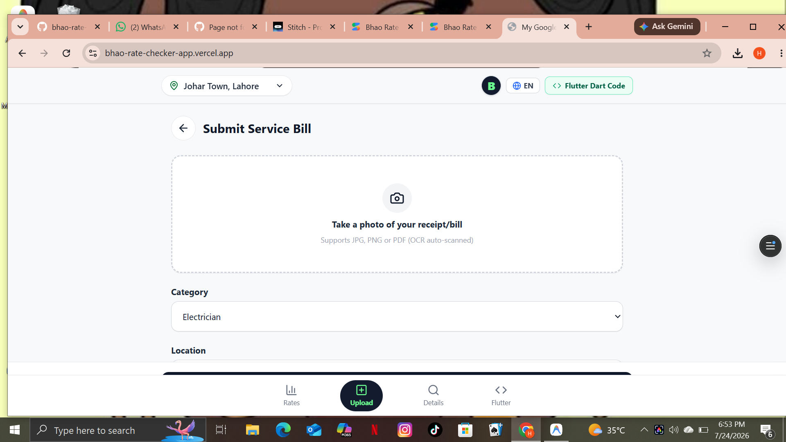

# Bhao Rate Checker

**Bhao Rate Checker** is a community-driven web application designed to bring transparency to service pricing across Pakistan. Our mission is to help users discover fair and verified market rates for everyday services before they hire anyone.

## 🌟 Problem We Solve

In Pakistan, there is no central place to check what plumbers, electricians, or AC technicians actually charge. People often overpay due to lack of information. Bhao solves this by crowdsourcing real payment data and showing city-wise average rates.

## 🔥 Key Features

- **City-Specific Pricing**: Get accurate rates for Lahore, Karachi, and Islamabad. More cities coming soon.
- **Wide Service Coverage**: AC Repair, Plumbing, Electrical Work, Painting, and more.
- **Verified Community Data**: All rates are based on actual payments made by real users.
- **Fairness Voting System**: Community votes if a quoted rate is Fair, High, or Low to ensure data accuracy.
- **100% Free & No Commission**: We provide information only. We do not take bookings or charge any fees.
- **Clean & Mobile-Friendly UI**: Fast and easy to use on any device.

## 🚀 Live Demo

Check out the live app here:  
**[https://bhao-rate-checker-app.vercel.app](https://bhao-rate-checker-app.vercel.app)**

## 🛠️ Tech Stack

| Category | Technology |
| --- | --- |
| Frontend | React.js, Tailwind CSS |
| Backend | Node.js, Express.js |
| Database | MongoDB |
| Deployment | Vercel |

## 📊 How It Works

1.  **Select Your City** - Choose from available cities.
2.  **Select a Service** - Pick the service you need.
3.  **View Average Rate** - See the community-verified average price range.
4.  **Contribute** - After getting a service, submit what you paid to help others.
5.  **Vote** - Help keep data accurate by voting on rates.

## 🎯 Future Roadmap

- Add 10+ more cities across Pakistan
- Add 20+ new service categories  
- User authentication and profile system
- Price history charts and trends

---

**Built with ❤️ to make service pricing transparent for everyone in Pakistan.**## 📸 App Screenshots

